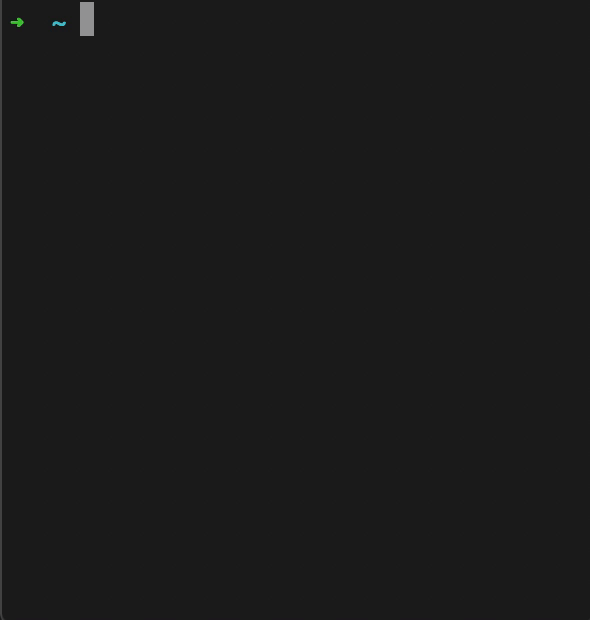

# GVM

GVM is a Go version manager. You can use commands of `install`, `list`, `switch` and `remove` to 
manage local installation of multiple Go versions.

{:height="50%" width="50%" margin="0 auto"}

GVM is just support for Unix-like system yet, and the working mechanism is very simple. 
GVM will create a `gvm` directory in `/usr/local` to host multiple versions of GOROOT, 
and create a symbol link named `go` in `/usr/local` referring to the specific version in `gvm` directory. 
So, you just need to add `/usr/local/go/bin` to `$PATH` environment variable to run go command, 
and use GVM to switch the reference of the symbol link.

Multiple versions of Go installed by GVM can share the same GOPATH compatibly, and this is also advocated by GVM.

## Installation

```
$ go get github.com/xvrzhao/gvm
```

This will install the `gvm` bin command into your `$GOPATH/bin` directory.

## Commands

For all available commands, see:

```
$ gvm help
```

## License

[MIT](./LICENSE)